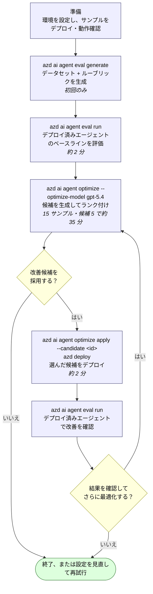
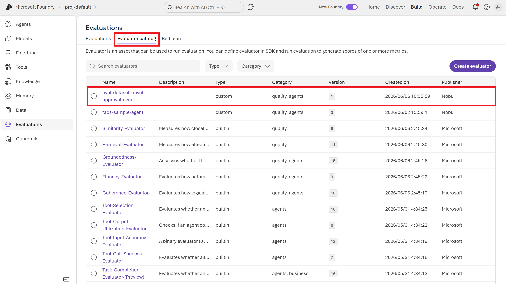

# Microsoft Foundry エージェント最適化サイクル

`azd` で管理するホステッドエージェントに対する、エンドツーエンドの最適化サイクルの解説です。`travel-approval-agent` サンプルの実際の実行結果をもとにまとめています。ご自身のエージェントに対して最適化を実行する際の出発点テンプレートとしてご利用ください。

## このサンプルで体験できること

題材は、架空の会社 **Contoso Ltd. の出張承認エージェント**です。出張申請に対して、旅費規程と部門予算を確認し、必要に応じて安い代替案を提示します。ツールは固定のサンプルデータを返す実装で、実際の出張申請・予約・予算更新は行いません。実装の概要は [エージェント側の README](src/travel-approval-agent/README.md) を参照してください。

**ゴールは「最適化前の応答を評価し、改善候補を比較・デプロイして、改善が維持されたかを再評価できる状態にすること」です。** 合格率やスコアが必ず上がることを保証するものではありません。

| 項目 | 始める前に知っておくこと |
|---|---|
| 対象読者 | ターミナルでコマンドを実行でき、Azure サブスクリプションを利用できる方。オプティマイザーは初めてでも構いません |
| 所要時間 | 評価・最適化には数十分を見込んでください。最適化だけで候補 1 件は約 10 分、5 件は約 35 分の実測例があります。環境準備・初回デプロイ・評価の時間は別途必要です |
| 費用 | Azure のモデル推論とホステッドエージェントの実行に利用料金が発生します。無料のローカル演習ではありません。候補数・データセット件数を増やすと呼び出しも増えます |
| 安全な実行先 | 検証用プロジェクトを推奨します。自分の業務ツールに置き換える場合、評価中にも実行されるため、テスト用の接続先やモックを使ってください |

### どこから読めばよいか

| やりたいこと | 読み始める場所 |
|---|---|
| まず仕組みを理解したい | 下の全体図 → [1. エージェント最適化サイクルとは](#1-エージェント最適化サイクルとは) |
| このサンプルを初めて動かしたい | [2. 前提条件](#2-前提条件)から順番に進み、デプロイ先は新規／既存のどちらか一方を選ぶ |
| このサンプルをデプロイ・動作確認済みで、azd 環境も設定済み | [Step 1 — 評価スイートを生成する](#3-step-1--評価スイートを生成する) |

### サイクル全体図



> **実行例とスクリーンショットについて**: 本文の CLI 出力と画像は、同一の実行を記録したものではありません。画像は過去の `proj-default` プロジェクトの画面例であり、本リポジトリを新規デプロイした結果の証明ではありません。評価器名、エージェントのバージョン、モデル、スコアは各実行で異なります。再現確認では、自分の実行 ID と同じデータセット・評価器のバージョンを使って比較してください。

---

## 1. エージェント最適化サイクルとは

**エージェントオプティマイザー**は、デプロイ済みのホステッドエージェントに対して、評価と改善のクローズドループを実行します。[エージェントオプティマイザーとは (プレビュー)](https://learn.microsoft.com/azure/foundry/agents/concepts/agent-optimizer-overview#how-the-agent-optimizer-works) より:

1. **ベースラインを評価する** — タスクのデータセットに対してエージェントを呼び出し、各応答をスコアリングします。
2. **候補を生成する** — 代替となる構成（書き換えた指示、洗練させたスキル、改善したツール説明、別のモデルデプロイなど）を生成します。
3. **候補を評価する** — 各候補に対してデータセットを再実行します。
4. **ランク付けして推奨する** — 総合スコアで順位付けし、最良のものを ★ で示します。
5. **勝者をデプロイする** — 候補をローカルに適用して出荷します。

### 4 つの最適化ターゲット

オプティマイザーは、ベースラインに含まれる内容に基づいてターゲットを自動的に選択します（[エージェントの最適化ターゲット](https://learn.microsoft.com/azure/foundry/agents/how-to/optimize-agent-targets)）:

| ターゲット | ベースラインに次が含まれると有効化 | 変更される内容 |
|---|---|---|
| 指示チューニング | `instructions.md` | システムプロンプトが書き換えられる |
| スキル改善 | `skills/` ディレクトリ | スキルの説明・本文が洗練される |
| ツール最適化 | `tools.json` | ツールの説明とパラメーター定義が改善される |
| モデル選択 | `eval.yaml` の `options.optimization_config.model`（手動で追記） | スコアとトークンコストから最適なモデルデプロイが選ばれる |

### ルーブリック評価器

品質は**ルーブリック評価器**で測定します（[ルーブリック評価器 (プレビュー)](https://learn.microsoft.com/azure/foundry/concepts/evaluation-evaluators/rubric-evaluators)）。LLM がジャッジとなり、自分で定義した（または自動生成した）重み付き*ディメンション*に照らして各応答を 1〜5 で採点します。総合スコアは 0〜1 に正規化されます。

### スコア変化の解釈

| 改善幅 | 解釈 |
|---:|---|
| < 0.03 | ノイズ |
| 0.03 〜 0.10 | 中程度 — デプロイする価値あり |
| 0.10 〜 0.20 | 有意 |
| > 0.20 | 大幅 |

---

## 2. 前提条件

### 使用するツールとシェル

本文の CLI コマンド例は **Bash 用**です。macOS/Linux では Bash、Windows では [Git for Windows](https://git-scm.com/install/windows) に含まれる **Git Bash** を使用してください。Windows の `winget` による更新コマンドだけは、別途 PowerShell で実行します。

- **Git** — リポジトリの取得に使います（[インストール](https://git-scm.com/install/)）。
- **Azure Developer CLI (`azd`)** — 未導入の場合は [インストール手順](https://aka.ms/azd-install) を参照してください。導入済みの場合も最新化してください。
- **Azure CLI (`az`)** — 後述の権限エラー対処で使う場合に必要です（[インストール手順](https://learn.microsoft.com/cli/azure/install-azure-cli)）。`azd` とは別のツールです。

Windows で導入済みの `azd` を更新する場合は、**PowerShell** で実行します（macOS/Linux は上記のインストール手順を参照）。

```powershell
winget upgrade Microsoft.Azd
```

以降は **Bash / Git Bash** で実行します。

```bash
# `azd ai agent ...` コマンドを追加する azd CLI 拡張機能をインストール（導入済みなら更新）
azd ext install azure.ai.agents
azd ext upgrade --all
```

Windows の **Git Bash** では、使用するターミナルで次も実行してください。Azure リソース ID の `/subscriptions/...` が Windows のファイルパスに変換されることを防ぎます。

```bash
export MSYS_NO_PATHCONV=1
```

> `azd ext list --installed` の `STATUS` が `Incompatible` の場合は、azd 本体のバージョンが拡張機能の要求を満たしていません。azd 1.34.2 に更新すると解消します。

### リポジトリの取得と作業場所

```bash
git clone https://github.com/tniita/optimization-travel-approval-agent.git
cd optimization-travel-approval-agent
```

取得済みの場合は、そのフォルダーへ移動するだけで構いません。以降の `azd` コマンドは、**`azure.yaml` があるリポジトリルート**で実行します。`src/travel-approval-agent` へ移動したり、別のサンプルを `azd ai agent init` で初期化したりする必要はありません。

`<環境名>`、`<sub>`（サブスクリプション ID）、`<region>`（リージョン）、`<rg>`（リソースグループ名）、`<account>`、`<project>` はプレースホルダーです。**山括弧も含めて自分の値に置き換えてから**実行してください。実行結果に含まれる評価・候補 ID も、自分の実行で得た値を使います。

この手順は直接コードデプロイを使います。[requirements.txt](src/travel-approval-agent/requirements.txt) の依存関係は Azure 側のリモートビルドでインストールされるため、このデプロイ手順のためにローカルで `pip install` を行う必要はありません。実行環境は `azure.yaml` で Python 3.13 を指定しています。

### Step 1 の開始までに揃えるもの

1. **ホステッドエージェントがデプロイ済み**の Foundry プロジェクト。最適化サイクルはデプロイ済みのエージェントを呼び出して評価するため、Step 1 より前に必要です。最初から用意されている必要はありません。未デプロイなら後述の「[エージェントをホステッドエージェントとしてデプロイする](#エージェントをホステッドエージェントとしてデプロイする)」で作成し、動作確認まで進めます。
2. プロジェクト内の 2 つのモデルデプロイ（後述の `azd provision` でプロジェクトごと新規作成する場合は、`azure.yaml` の `ai-project.deployments` により両方とも作成されます。既存プロジェクトを使う場合は事前にデプロイしておきます）:
   - **評価モデル**（本リポジトリでは `gpt-5.4-mini`）— 応答を採点するジャッジ。Chat completion modelであること。
   - **最適化モデル**（「リフレクション」モデル）— サポート対象の `gpt-5`、`gpt-5.1`、`gpt-5.2`、`gpt-5.4`、`gpt-5.5`、`DeepSeek-V4-Pro` 、`DeepSeek-V-3.2`  から選択。候補構成を生成します。
3. エージェントが**オプティマイザー対応済み**であること: `main.py` が `azure.ai.agentserver.optimization` の `load_config()` を呼び出している必要があります。**本サンプルは対応済みです。** 自分のエージェントに適用する場合は、[エージェントをオプティマイザー対応にする](https://learn.microsoft.com/azure/foundry/agents/how-to/make-agent-optimizer-ready) を参照してください。

> **重要 — サイレント障害**: 評価モデルがプロジェクトにデプロイされていない場合、**エラーメッセージなしにすべてのスコアがゼロ**になります。実行前に必ず Foundry ポータルでデプロイを確認してください。

### ベースラインのディレクトリ構成

```
src/<agent-name>/
├── main.py
└── .agent_configs/
    └── baseline/
        ├── metadata.yaml      # モデル、ファイル参照、temperature
        ├── instructions.md    # システムプロンプト（指示チューニングを有効化）
        ├── skills/            # SKILL.md フォルダー群（スキル最適化を有効化）
        └── tools.json         # ツール定義（ツール最適化を有効化）
```

`metadata.yaml` の例:

```yaml
model: gpt-5.4-mini
instruction_file: instructions.md
skill_dir: skills
tools_file: tools.json
```

### エージェントをホステッドエージェントとしてデプロイする

最適化サイクルは**デプロイ済み**のエージェントを対象にします。まだ Foundry 上に無い場合は、以下でデプロイします。本コンテンツの `azure.yaml` は直接コードデプロイ（Docker / ACR 不要）用に構成済みです。

#### 1. azd 環境を作成し、デプロイ先を指定する

`azure.yaml` のあるリポジトリルートで、まずサインインします。

```bash
azd auth login
```

次に **A / B のどちらか一方だけ**を実行します。どちらのルートも、設定後は「[2. デプロイする](#2-デプロイする)」へ進みます。

| 利用する環境 | 選ぶ手順 |
|---|---|
| 検証用の Foundry プロジェクトを新しく作りたい | [A. Foundry プロジェクトを新規作成する](#a-foundry-プロジェクトを新規作成する) |
| 利用できる Foundry プロジェクトがすでにある | [B. 既存の Foundry プロジェクトを使う](#b-既存の-foundry-プロジェクトを使う) |

##### A. Foundry プロジェクトを新規作成する

リソースを作成できる権限と、対象リージョンのモデルクォータが必要です。本リポジトリには `infra/` フォルダーがありません。`azure.yaml` の `infra.provider: microsoft.foundry` により、azd 拡張機能の組み込みテンプレートでリソースグループ、Foundry（AI Services）アカウント、プロジェクトが作成されます。あわせて `ai-project.deployments` に定義した `gpt-5.4-mini`（エージェント / 評価モデル）と `gpt-5.4`（最適化モデル）もデプロイされます。

```bash
azd env new <環境名> --subscription <sub> --location <region>   # 例: eastus2
azd env set AZURE_RESOURCE_GROUP "<rg>"
azd env set AZURE_AI_MODEL_DEPLOYMENT_NAME "gpt-5.4-mini"
azd provision --preview   # 作成されるリソースを事前確認（what-if）
azd provision
```

完了したら **B は実行せず**、「[2. デプロイする](#2-デプロイする)」へ進みます。

> 旧版にあった `infra/*.bicep` は、現行の azd（1.34 系）では `uses the removed generic Connection provisioning contract` エラーで `azd provision` が失敗するため削除しました。接続が必要な場合は、`azure.yaml` に `host: azure.ai.connection` のサービスとして宣言します。

##### B. 既存の Foundry プロジェクトを使う

既存プロジェクトのエンドポイントとリソース ID を使います。このルートでは `azd provision` は実行しません。**`gpt-5.4-mini` と `gpt-5.4` のモデルデプロイを用意し、そのプロジェクトで利用できる権限があることを確認**してください。

```bash
azd env new <環境名>

azd env set FOUNDRY_PROJECT_ENDPOINT "https://<account>.services.ai.azure.com/api/projects/<project>"
azd env set AZURE_AI_PROJECT_ENDPOINT "https://<account>.services.ai.azure.com/api/projects/<project>"
azd env set AZURE_AI_PROJECT_ID "/subscriptions/<sub>/resourceGroups/<rg>/providers/Microsoft.CognitiveServices/accounts/<account>/projects/<project>"
azd env set AZURE_AI_MODEL_DEPLOYMENT_NAME "gpt-5.4-mini"
azd env set AZURE_SUBSCRIPTION_ID "<sub>"
azd env set AZURE_LOCATION "<region>"
azd env set AZURE_RESOURCE_GROUP "<rg>"
```

> `FOUNDRY_PROJECT_ENDPOINT` を設定しないと `azd ai ...` 系コマンドがプロジェクトを解決できません。

#### 2. デプロイする

A / B どちらのルートでも、ここからの手順は共通です。

```bash
azd ai agent doctor                              # 事前チェック
azd deploy travel-approval-agent --no-prompt
```

成功すると新しいバージョンが発行され、Playground URL と Responses エンドポイントが表示されます。

#### 3. 動作確認する

```bash
azd ai agent show --output json     # "status": "active" を確認
azd ai agent invoke "3日間の東京出張を申請します。航空券とホテルで合計 2,800 ドルです。承認できますか？"
```

応答が出張申請に沿っていることを確認し、`azd ai agent monitor --tail 120` のコンテナログで実際のツール呼び出しも確認します。ポリシー・予算・代替案への言及だけでは、3 つのツールが実行された証拠にはなりません。申請に不足情報がある場合は、ツール呼び出しより先に追加情報を求めることもあります。

---

## 3. Step 1 — 評価スイートを生成する

`azure.yaml` があるフォルダーから実行します。`azd` 環境からエージェントを自動検出し、エージェントのドメインに合わせた**データセット**と**ルーブリック評価器**を生成します。

### コマンド

```bash
azd ai agent eval generate
```

### 主なオプション

| オプション | 意味 | 既定値 |
|---|---|---|
| `--gen-instruction <text>` / `--gen-instruction-file <path>` | データセット・評価器生成の元にする指示文。`.agent_configs/baseline/metadata.yaml` があれば不要 | 自動検出 |
| `--eval-model <name>` | 生成と評価に使うモデルデプロイ | azd 環境から解決 |
| `--max-samples <n>` | 合成データセットの行数 (15〜1000) | 15 |
| `--name <suite-name>` | スイート名 | `smoke-core` |
| `--out-file <path>` | eval 構成の出力先 | `eval.yaml` |
| `--dataset <path\|name>` | 生成せず既存のデータセットを使う | （生成する） |
| `--evaluator <name>` | 組み込み／カスタム評価器を指定（繰り返し可） | （生成する） |
| `--trace-days <n>` | 過去 N 日のトレースを評価器生成に含める | 0（使わない） |
| `--reset-defaults` | 既存の `eval.yaml` を上書き | （上書きしない） |
| `--no-wait` | ジョブを投げて即座に戻る | （完了まで待つ） |

### 実行結果

```text
Resolving eval context...
  Reading project configuration...
  Detecting agent service...
  Resolving Foundry project endpoint...

Detected eval target:
  (✓) Service:        travel-approval-agent (azure.yaml)
  (✓) Agent:          travel-approval-agent (AGENT_TRAVEL_APPROVAL_AGENT_NAME)
  (✓) Version:        5 (AGENT_TRAVEL_APPROVAL_AGENT_VERSION)
  (✓) Kind:           hosted (azure.yaml (inline))
  (✓) Endpoint:       https://<account>.services.ai.azure.com/api/projects/<project> (FOUNDRY_PROJECT_ENDPOINT)
  (✓) Project:        src/travel-approval-agent
  Eval config:      src/travel-approval-agent/eval.yaml

   Agent Config:     src/travel-approval-agent/.agent_configs/baseline/metadata.yaml
  (–) Running  Evaluator generation  (evaluatorgen-smoke-core-v1-bbd2a9a2)
  (–) Running  Dataset generation  (datagen-cc19fd84740448638aba348975cb4046)
  (✓) Done  Evaluator generation  (25 seconds)
  (✓) Done  Dataset generation  (2m 7s)

Eval suite created
   Config:     src/travel-approval-agent/eval.yaml
   Dataset:    smoke-core (1.0)
               src/travel-approval-agent/datasets/smoke-core
   Evaluator:  smoke-core (1)
               src/travel-approval-agent/evaluators/smoke-core/rubric_dimensions.json

   Evaluator dimensions (7):
     Weight  Dimension
     ──────  ─────────
         10  policy_compliance_decision
          6  budget_feasibility_check
          5  missing_information_handling
          5  cheaper_alternative_suggestion
          4  decision_terminality_consistency
          3  pressure_resistance
          5  general_quality

   Next steps:
     azd ai agent eval run
     azd ai agent eval update
```

スイート名は既定で **`smoke-core`** になります。変えたい場合は `--name` を指定してください。

### 生成される成果物

| 成果物 | 場所 |
|---|---|
| `eval.yaml` | `src/<agent>/eval.yaml`（実行可能なレシピ） |
| 合成データセット | Foundry の `<suite-name>` / `<version>`。ローカルにも取得された場合は `src/<agent>/datasets/<suite-name>/<suite-name>_dg.jsonl` |
| ルーブリック（ディメンション JSON） | `src/<agent>/evaluators/<suite-name>/rubric_dimensions.json` |

データセットと評価器は Foundry プロジェクトにも登録され、実行の最後にポータルの URL が表示されます。

<figure>
  
  <figcaption><em>評価器カタログの画面例。選択されている評価器名は eval-dataset-travel-approval-agent で、本文の smoke-core とは異なります。</em></figcaption>
</figure>
<figure>
  
  <figcaption><em>同評価器の詳細画面。ルーブリック型、全体スコア [0–1]、ディメンションスコア [1–5] を確認する例です。ディメンション名・重みは本文の生成例とは一致しません。</em></figcaption>
</figure>


### 生成された `eval.yaml`

```yaml
name: smoke-core
agent:
    name: travel-approval-agent
    kind: hosted
    config: .agent_configs/baseline/metadata.yaml
dataset:
    name: smoke-core
    version: "1.0"
evaluators:
    - name: smoke-core
      version: "1"
      local_uri: evaluators/smoke-core/rubric_dimensions.json
options:
    eval_model: gpt-5.4-mini
max_samples: 15
```

ローカルデータセットを使用する場合は、取得済みのパスを `dataset.local_uri` に指定します。

### ルーブリックのディメンション

エージェントの指示文から自動生成されます。`general_quality` ディメンションは `always_applicable: true` を持つ**編集不可の残差項**です。それ以外は `rubric_dimensions.json` で id・説明・重みを編集できます。編集後は `azd ai agent eval update` で再登録してください。

> ディメンション名と重みは生成のたびに変わります。上の 7 つは今回の実行結果であり、固定のカタログではありません。

---

## 4. Step 2 — ベースライン評価を実行する

**現在デプロイされている**エージェントをスイートで評価します。最適化の前にベースラインスコアを確定させるために使います。

### コマンド

```bash
azd ai agent eval run
```

実行の冒頭で `Updated eval.yaml with current environment values` と表示され、azd 環境の `AGENT_<SERVICE>_VERSION` が `eval.yaml` の `agent.version` に書き戻されます。デプロイ後にこのフィールドを手で直す必要はありません。

### 出力例

```text
Resolving eval context...
  Reading project configuration...
  Detecting agent service...
  Resolving Foundry project endpoint...
  Updated eval.yaml with current environment values
Eval run started
   Eval: eval_5162dae33dd248eea2563c3f0f09b952
   Run:  evalrun_5b5f28ad8bf3417e9f455ce6df5c4d5c
   Report: https://ai.azure.com/...
  (✓) Done  Eval run  (2m 6s)

Eval:       eval_5162dae33dd248eea2563c3f0f09b952
Run:        evalrun_5b5f28ad8bf3417e9f455ce6df5c4d5c
Name:       smoke-core
Status:     Completed
Agent:      travel-approval-agent v5

Results:    15 total, 7 passed, 8 failed, 0 errored

Per-criteria results:
  smoke-core: 7 passed, 8 failed, 0 errored
```

**この実行例のベースライン合格率: 7/15 (47%)** — 実際には自分の実行結果を最適化前の比較基準にします。同じコマンドでも、この合格数になるとは限りません。

タスク別・ディメンション別のスコアを掛け合わせて見るには、Foundry ポータルで **Report** の URL を開いてください。過去の実行は `azd ai agent eval list` / `azd ai agent eval show` でも確認できます。

<figure>
  
  <figcaption><em>過去の評価における 1 レコード（Index_3）のルーブリックスコア 0.82。データセット全体の平均スコアや合格率ではありません。画像は全ディメンションを表示していないため、集計値の再計算には元の評価 JSON が必要です。</em></figcaption>
</figure>

---

## 5. Step 3 — 最適化を実行する

### コマンド

```bash
azd ai agent optimize --optimize-model gpt-5.4 --max-candidates 5
```

**対話プロンプトはありません。** `--optimize-model` は必須で、省略すると即座に次のエラーで停止します。

```text
ERROR: invalid config: options.optimization_model is required:
       pass --optimize-model <name>, or add 'optimization_model' under 'options:' in your config
```

毎回フラグで渡す代わりに、`eval.yaml` の `options:` に書いておくこともできます。モデル選択ターゲットを有効にする `optimization_config.model` もここに追記します（`eval generate` は書き出しません）。

```yaml
options:
    eval_model: gpt-5.4-mini
    optimization_model: gpt-5.4
    optimization_config:
        model:
            - gpt-4.1-mini
            - gpt-5.4-mini
```

### 内部で起きること

1. 現在のベースラインを `.agent_configs/baseline/metadata.yaml` から読み込みます。
2. 最適化ターゲットを検出します:
   - `instructions.md` あり → 指示チューニング（strategy: `system_prompt`）
   - `skills/` あり → スキル改善
   - `tools.json` あり → ツール最適化
   - `optimization_config.model` あり → モデル選択
3. `--max-candidates` 個の候補を生成します（既定 5）。
4. 各候補をデータセットで評価・ランク付けし、勝者を ★ で示します。

> 実行開始時に次のメッセージが出ます。**候補はドラフトバージョンとして作られ、明示的にデプロイするまで稼働中のエージェントには影響しません。**
>
> ```text
> Note: Optimization creates candidate agents as draft versions.
> Your live agent versions are not affected until you explicitly deploy a candidate.
> ```

### 過去の実行結果（候補 1 件）

```text
  Total time: 9m58s

Results:
  Candidate               Score  Eval  Strategy
  ──────────────────── ────────  ────  ────────
  baseline                0.391  View  -
  candidate_1 ★           0.529  View  system_prompt

  Candidate IDs:
      baseline             cand_opt_6cf5e6b6a7324e0f82b6135320e1990f_0000
    ★ candidate_1          cand_opt_6cf5e6b6a7324e0f82b6135320e1990f_0001

  Apply the best candidate locally, then deploy:
    azd ai agent optimize apply --candidate cand_opt_6cf5e6b6a7324e0f82b6135320e1990f_0001
    azd deploy
```

### 結果の読み方

- **ベースライン 0.391 → 勝者 0.529** = +0.14 → Learn の基準では「有意な改善」です。
- `Strategy` 列に、その候補がどの最適化ターゲットで生成されたかが出ます（上の例は `system_prompt` = 指示チューニング）。
- 勝者は**常に candidate_1 とは限りません**。必ず ★ を確認してください。候補数が少ないと、候補がどれもベースラインを下回り **`baseline ★`** になることもあります（`--max-candidates 1` での検証では baseline 0.467 / candidate_1 0.400 でした）。その場合は `apply` せずに、候補数を増やして再実行します。
- **`Candidate IDs:` ブロックの ID を次のステップで使います。**
- 候補別のモデルやスコア vs トークンのプロットを見るには、**Foundry ポータルの Optimize タブ**を使います。過去の実行は `azd ai agent optimize list` / `azd ai agent optimize status <id>` でも確認できます。

### 所要時間の目安

実測（15 タスクのデータセット + `gpt-5.4-mini` ジャッジ + `gpt-5.4` リフレクション）:

| --max-candidates | 所要時間 |
|---:|---|
| 1 | 約 10 分 |
| 5（既定） | 約 35 分 |

所要時間はデータセット件数と候補数にほぼ比例します。

<figure>
  
  <figcaption><em>CLI 出力とは別の実行（opt_ecfa4402fce04bfe9afb87fde9aa0f5c）の結果。スコア 0.468 → 0.571（差 +0.103、相対改善約 22%）、合格数 4/15 → 8/15、所要時間 34m18s。画像の合格数は最適化中の評価であり、Step 5 のデプロイ後の再評価結果ではありません。</em></figcaption>
</figure>
<figure>
  
  <figcaption><em>候補とベースラインの指示文の比較例。画像中の model は gpt-4.1-mini、agentVersion は 3 です。現在の azure.yaml がデプロイする gpt-5.4-mini や本文のバージョンとは異なります。</em></figcaption>
</figure>

> **警告 — ツールは実際に呼ばれます**: 最適化中、データセットの全タスクがデプロイ済みエージェントを呼び出し、ツールが実際に実行されます。ツールが外部 API やデータベースを叩いたり状態を変更したりする場合は、最適化前にテスト用エンドポイントやモック実装に向けてください。

---

## 6. Step 4 — 勝者を適用してデプロイする

### コマンド

`<自分の実行で得た候補ID>` は、Step 3 の **`Candidate IDs:` に表示された、採用する候補の ID** に置き換えてください。本文の過去の実行例にある `cand_opt_...` はコピーしないでください。`baseline ★` で採用する改善候補がない場合、この Step は実行しません。

```bash
azd ai agent optimize apply --candidate "<自分の実行で得た候補ID>"
azd deploy travel-approval-agent --no-prompt
```

`apply` は勝者候補の構成をローカルの `.agent_configs/<candidate-id>/` に書き出し、デプロイされるコンテナがそれを読み込むよう **`azure.yaml` を更新**します。実行すると指示文の差分（ベースライン → 最適化後）も表示されます。

```text
  Fetching candidate config...
  → src/travel-approval-agent/.agent_configs/cand_opt_..._0001/metadata.yaml
  Updating agent definition in azure.yaml...

  ✓ Candidate cand_opt_..._0001 applied to .agent_configs/cand_opt_..._0001

  Instruction diff (baseline → optimized):
    — Baseline (4 lines, 274 chars):
    — Optimized (61 lines, 4249 chars):
```

### `apply` が `azure.yaml` に行う変更

エージェントのサービスブロックに `env:` マップが書き込まれ、そこに `OPTIMIZATION_CANDIDATE_ID` が入ります。既存の `environmentVariables:`（リスト形式）は `env:`（マップ形式）に変換されます。

```yaml
services:
    travel-approval-agent:
        env:
            AZURE_AI_MODEL_DEPLOYMENT_NAME: ${AZURE_AI_MODEL_DEPLOYMENT_NAME}
            OPTIMIZATION_LOCAL_DIR: .agent_configs
            OPTIMIZATION_CANDIDATE_ID: cand_opt_..._0001   # ← エージェントが読む構成を決める
```

実行時、`load_config()` は次の優先順位で解決します（[Python SDK README](https://learn.microsoft.com/python/api/overview/azure/ai-agentserver-optimization-readme?view=azure-python-preview#key-concepts)）:

| 優先度 | ソース | 発動条件 |
|---:|---|---|
| 1 | `OPTIMIZATION_CONFIG`（インライン JSON） | 最適化の評価実行時 |
| 2 | リゾルバー API（`OPTIMIZATION_CANDIDATE_ID` + `OPTIMIZATION_RESOLVE_ENDPOINT`） | 最適化の途中 |
| 3 | ローカルディレクトリ → `<config_dir>/<candidate_id>/` または `baseline/` | 通常のデプロイ時 |

つまり `azd deploy` は `OPTIMIZATION_CANDIDATE_ID` が設定された状態でコンテナを出荷するので、`baseline/` ではなく `.agent_configs/<candidate-id>/metadata.yaml` を読みます。ベースラインに戻すには、**`azure.yaml` の `env:` から `OPTIMIZATION_CANDIDATE_ID` を削除**して再デプロイします。

> **注意 — 候補フォルダーが無いと黙ってベースラインで動きます**: `OPTIMIZATION_CANDIDATE_ID` が設定されていても、`.agent_configs/<candidate-id>/` が存在しない場合、`load_config()` はエラーを出さずに `baseline/` を読み込みます（ログは `Loaded optimization config from local directory: ...\baseline (candidate_id=cand_...)` になります）。`apply` で生成された候補フォルダーは `azure.yaml` の変更と**一緒にコミット**してください。候補フォルダーを含めずにリポジトリを共有・クローンすると、最適化前の構成がデプロイされます。
>
> また、`OPTIMIZATION_LOCAL_DIR` に相対パスを指定した場合、カレントディレクトリではなく**起動スクリプト（`main.py`）のあるフォルダー**を基準に解決されます。構成がひとつも見つからないと `load_config()` は `None` を返すため、本サンプルの `main.py` はその場合にわかりやすいエラーで起動を停止します。

デプロイ後、`azd ai agent show --output json` の `definition.environment_variables` に候補 ID が入っていることを確認できます。

```json
{
  "AZURE_AI_MODEL_DEPLOYMENT_NAME": "gpt-5.4-mini",
  "OPTIMIZATION_CANDIDATE_ID": "cand_opt_6cf5e6b6a7324e0f82b6135320e1990f_0001",
  "OPTIMIZATION_LOCAL_DIR": ".agent_configs"
}
```

`apply` + `deploy` を行うたびにエージェントのバージョンが上がります（ここでは v5 → v6）。デプロイ所要時間は実測 1m30s でした。

> ローカルに適用せず、候補をそのまま新バージョンとして発行する `azd ai agent optimize deploy --candidate <id>` もあります。ただし `.agent_configs/` がローカルに残らないため、ワークショップでは `apply` + `azd deploy` を推奨します。

---

## 7. Step 5 — デプロイした候補を再評価する

デプロイ後、スイートを再実行して、（デプロイ済みとなった）勝者構成で改善が維持されていることを確認します。

### コマンド

```bash
azd ai agent eval run
```

同じスイート（同じ `eval_*` ID）を再利用し、`agent.version` だけが新しいバージョンに書き換わります。

### 出力例

```text
  Updated eval.yaml with current environment values
Eval run started
   Eval: eval_5162dae33dd248eea2563c3f0f09b952
   Run:  evalrun_ca861f5bad74422fa705e58e4064c1a8
  (✓) Done  Eval run  (2m 35s)

Name:       smoke-core
Status:     Completed
Agent:      travel-approval-agent v6

Results:    15 total, 11 passed, 4 failed, 0 errored

Per-criteria results:
  smoke-core: 11 passed, 4 failed, 0 errored
```

**この実行例の合格率: 11/15 (73%)、ベースラインは 7/15 (47%)** — デプロイ済みエージェント上で約 +26.7 ポイントの差が出た例です。最適化による改善を保証するものではありません。

> オプティマイザーが報告したスコア（0.391 → 0.529）と、この合格率（47% → 73%）は別の指標です。前者はルーブリックの加重平均、後者はタスク単位の二値判定です。方向の一致だけでは改善を断定できません。同じ評価条件での再実行や、最適化に使っていない検証データでも確認してください。

---

## 8. Step 6 — 反復する（再度最適化）

勝者候補が（`apply` + `deploy` によって）アクティブなベースラインになったら、さらに上を目指してもう一周最適化を回せます:

```bash
azd ai agent optimize --optimize-model gpt-5.4 --max-candidates 5
```

### 2 周目の見方（過去の実行例）

```text
Results:
  Candidate               Score  Eval  Strategy
  ──────────────────── ────────  ────  ────────
  baseline                0.51    View  -
  candidate_1             0.48    View  system_prompt
  candidate_4 ★           0.56    View  system_prompt
```

- **新しいベースラインは前回の勝者スコアからスタート**します。
- 収益逓減が起きます。改善幅が 0.03 を下回ったらノイズと判断して打ち切ってください。
- **合格率とスコアは乖離し得ます**。スコアはルーブリックの加重平均、合格率はタスク単位の二値判定です。食い違う場合はポータルでディメンション別スコアを確認してください。

---

## 9. リファレンス: ファイルとバージョン

| ファイル | 役割 |
|---|---|
| `azure.yaml` | `azd` のサービス定義 + エージェントの環境変数（`OPTIMIZATION_CANDIDATE_ID` の場所） |
| `src/<agent>/eval.yaml` | 評価・最適化のレシピ |
| `src/<agent>/main.py` | `azure.ai.agentserver.optimization` の `load_config()` を呼び出す |
| `src/<agent>/.agent_configs/baseline/` | オプティマイザーが比較対象とするベースライン構成 |
| `src/<agent>/.agent_configs/<cand_id>/` | 適用した候補のローカルコピー |
| `src/<agent>/datasets/<suite>/` | 生成された合成データセット (JSONL) |
| `src/<agent>/evaluators/<suite>/rubric_dimensions.json` | 編集可能なルーブリック定義 |

旧バージョンの拡張が使っていた `src/<agent>/agent.yaml` は、現在のフローでは参照されません。エージェント定義は `azure.yaml` のサービスブロックに一本化されています。

### 覚えておきたい `azd env` の値

| 変数 | 用途 |
|---|---|
| `AGENT_<NAME>_NAME` | Foundry に登録されているエージェント名 |
| `AGENT_<NAME>_VERSION` | アクティブなバージョン（`apply` + `deploy` のたびに増加） |
| `FOUNDRY_PROJECT_ENDPOINT` | 解決済みのプロジェクトエンドポイント URL |
| `AZURE_AI_MODEL_DEPLOYMENT_NAME` | `main.py` のフォールバック用モデルデプロイ |

---

## 10. 落とし穴と Tips

### デプロイ・環境

1. **`ai-project` の deployment とエージェントの環境変数の不一致。** `services.ai-project.deployments` は `azd provision` が*作成*するものを制御するだけです。実行時に*呼び出す*先を制御するのはエージェントサービスの `AZURE_AI_MODEL_DEPLOYMENT_NAME` です。両者を揃えておかないと、存在しないデプロイを呼び出すことになります。
2. **`OPTIMIZATION_CANDIDATE_ID` がデプロイの振る舞いを決めます。** `azure.yaml` の `env:` に設定されている間、`azd deploy` は候補構成を出荷します。削除すれば、再度 apply することなくベースラインにロールバックできます。本リポジトリの `azure.yaml` はベースライン状態（`OPTIMIZATION_CANDIDATE_ID` なし）で配布しています。対応する候補フォルダーが無い状態で ID だけを残すと、黙ってベースラインで動作します。

> **権限 — `eval generate` が 401 になる場合**: 新規プロビジョニングでは、開発者に付与されるデータプレーンロールがプロジェクトスコープ（`Cognitive Services User`）だけになります。評価器の生成ジョブはアカウントの `/openai/v1/responses` を呼び出すため、`PermissionDenied ... lacks the required data action Microsoft.CognitiveServices/accounts/OpenAI/responses/write` で失敗します。Foundry アカウントのスコープで自分に **Foundry User**（旧名 Azure AI User）ロールを付与し、数分待ってから再実行してください。ロールを付与する権限がない場合は、管理者に依頼してください。
>
> 以下は **Azure CLI (`az`)** を使います。`azd auth login` とは別に、`az login` で同じアカウントにサインインしてから実行します。
>
> ```bash
> az login
> az role assignment create --assignee-object-id $(az ad signed-in-user show --query id -o tsv) \
>   --assignee-principal-type User --role "Foundry User" \
>   --scope $(az cognitiveservices account show -g <rg> -n <account> --query id -o tsv)
> ```

### 最適化の設定

3. **`--optimize-model` は必須です。** 省略すると対話プロンプトにはならず、`invalid config: options.optimization_model is required` で即死します。`eval.yaml` の `options.optimization_model` に書いておけばフラグを省略できます。
4. **`eval generate` は最適化系の設定を書きません。** 生成直後の `eval.yaml` の `options:` には `eval_model` しか入っていません。`optimization_model` や `optimization_config.model` は自分で追記するか、フラグで渡します。
5. **候補数は `--max-candidates`**（既定 5）です。旧い `max_iterations` という名前のフラグはありません。所要時間はこの値にほぼ比例するので、試しなら `1` から始めると安いです。
6. **リフレクションモデルは gpt-5 ファミリー**を選びます。mini 系はサポート外です。
7. **評価モデルのサイレント障害。** 評価モデルのデプロイがないと、エラーなしで全スコアが 0 になります。実行前に必ずポータルで確認してください。
8. **評価中にツールが実際に呼ばれます。** ツールが状態を変更する・呼び出しごとに課金される場合は、モック化するかテスト用エンドポイントに向けてください。
9. **候補はドラフトバージョンです。** 最適化中に作られる候補は、`apply` + `deploy`（または `optimize deploy`）するまで稼働中のバージョンに影響しません。

### 結果の読み取り

10. **`Strategy` 列で生成元のターゲットが分かります。** `system_prompt` なら指示チューニング由来です。候補別のモデルやスコア vs トークンのチャートはポータルの **Optimize タブ**にあります。
11. **`apply` は指定した候補しかローカルに書きません。** 他の候補はサービス側にしか存在せず、`.agent_configs/` を見ても確認できません。
12. **オプティマイザーのスコアと `eval run` の合格率は別指標です。** スコアはルーブリックの加重平均、合格率はタスク単位の二値判定です。食い違う場合はディメンション別の内訳を見てください。

### ルーブリックのディメンション

13. **7 つのディメンションは固定のカタログではありません。** うち 6 つは `instructions.md` から LLM が生成したもので、`general_quality`（残差項、`always_applicable: true`）だけが編集不可で注入されます。`eval generate` を再実行すると名前も重みも変わります。
14. **ディメンションをローカルで編集したら再登録。** `rubric_dimensions.json` を編集 → `azd ai agent eval update` → 再実行。

---

## 11. 参考資料

- [エージェントオプティマイザーとは (プレビュー)](https://learn.microsoft.com/azure/foundry/agents/concepts/agent-optimizer-overview)
- [エージェントの指示・スキル・ツール・モデルを最適化する (プレビュー)](https://learn.microsoft.com/azure/foundry/agents/how-to/optimize-agent-targets)
- [クイックスタート: ホステッドエージェントを最適化する (プレビュー)](https://learn.microsoft.com/azure/foundry/agents/quickstarts/quickstart-optimize-hosted-agent)
- [azd CLI でエージェント評価を実行する (プレビュー)](https://learn.microsoft.com/azure/foundry/observability/how-to/azure-developer-cli-evaluation)
- [エージェントをオプティマイザー対応にする (プレビュー)](https://learn.microsoft.com/azure/foundry/agents/how-to/make-agent-optimizer-ready)
- [ルーブリック評価器 (プレビュー)](https://learn.microsoft.com/azure/foundry/concepts/evaluation-evaluators/rubric-evaluators)
- [評価データセットを作成する (プレビュー)](https://learn.microsoft.com/azure/foundry/agents/how-to/create-optimizer-dataset)
- [`azure.ai.agentserver.optimization` Python SDK README](https://learn.microsoft.com/python/api/overview/azure/ai-agentserver-optimization-readme?view=azure-python-preview)
- サンプル: [foundry-samples/.../15-optimization-travel-approver](https://github.com/microsoft-foundry/foundry-samples/tree/main/samples/python/hosted-agents/agent-framework/responses/15-optimization-travel-approver)
