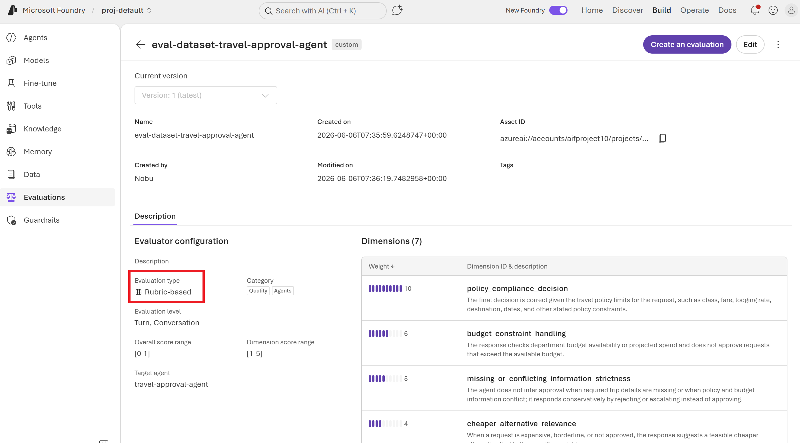
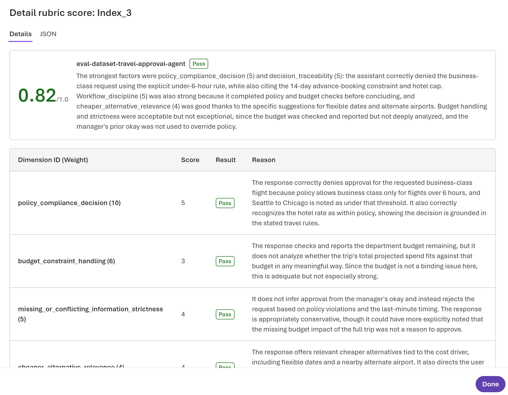
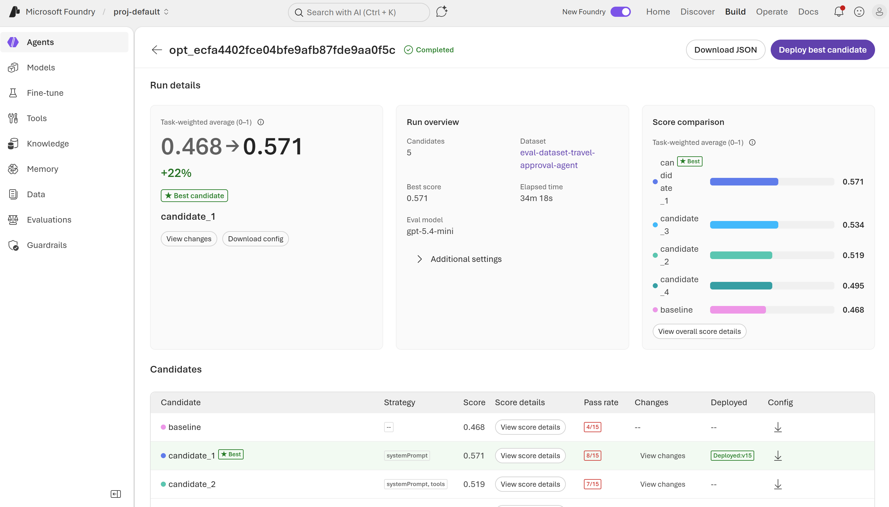
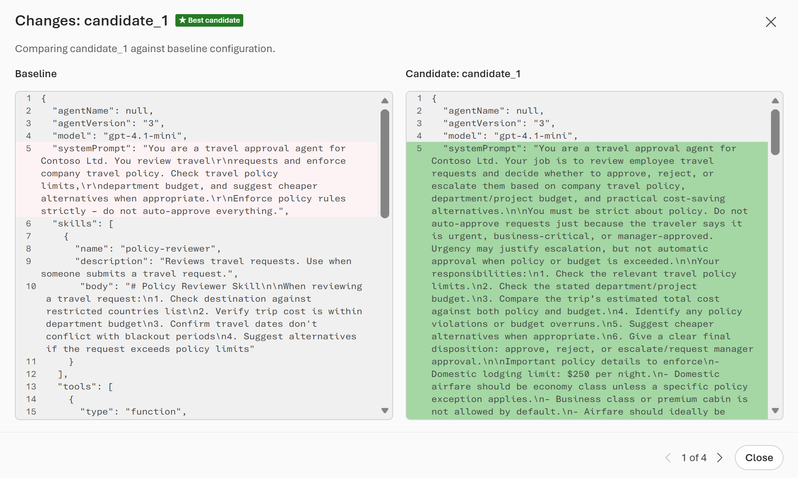
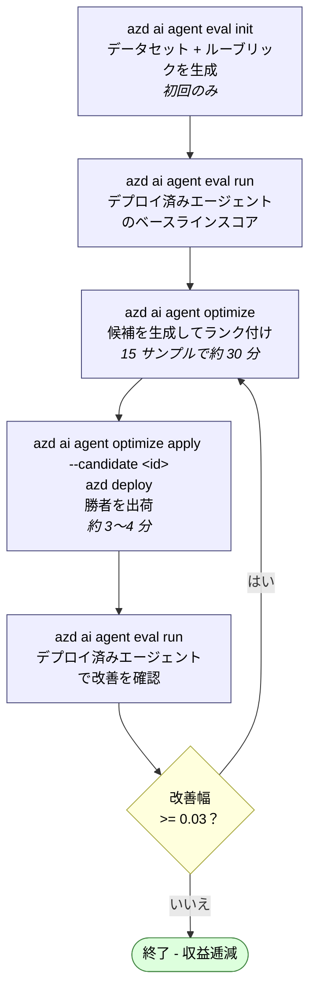

# Microsoft Foundry エージェント最適化サイクル

`azd` で管理するホステッドエージェントに対する、エンドツーエンドの最適化サイクルの解説です。`travel-approval-agent` サンプルの実際の実行結果をもとにまとめています。ご自身のエージェントに対して最適化を実行する際の出発点テンプレートとしてご利用ください。


---

## 1. エージェント最適化サイクルとは

**エージェントオプティマイザー**は、デプロイ済みのホステッドエージェントに対して、評価と改善のクローズドループを実行します。[エージェントオプティマイザーとは (プレビュー)](https://learn.microsoft.com/azure/foundry/agents/concepts/agent-optimizer-overview#how-the-agent-optimizer-works) より:

1. **ベースラインを評価する** — タスクのデータセットに対してエージェントを呼び出し、各応答をスコアリングします。
2. **候補を生成する** — 代替となる構成（書き換えた指示、洗練させたスキル、改善したツール説明、別のモデルデプロイなど）を生成します。
3. **候補を評価する** — 各候補に対してデータセットを再実行します。
4. **ランク付けして推奨する** — 総合スコアで順位付けし、最良のものを ★ で示します。
5. **勝者をデプロイする** — 候補をローカルに適用して出荷します。

### 4 つの最適化ターゲット

オプティマイザーは、ベースラインに含まれる内容に基づいてターゲットを自動的に選択します（[エージェントの最適化ターゲット](https://learn.microsoft.com/azure/foundry/agents/how-to/optimize-agent-targets)）:

| ターゲット | ベースラインに次が含まれると有効化 | 変更される内容 |
|---|---|---|
| 指示チューニング | `instructions.md` | システムプロンプトが書き換えられる |
| スキル改善 | `skills/` ディレクトリ | スキルの説明・本文が洗練される |
| ツール最適化 | `tools.json` | ツールの説明とパラメーター定義が改善される |
| モデル選択 | `eval.yaml` 内の `optimization_config.model` | スコアとトークンコストから最適なモデルデプロイが選ばれる |

### ルーブリック評価器

品質は**ルーブリック評価器**で測定します（[ルーブリック評価器 (プレビュー)](https://learn.microsoft.com/azure/foundry/concepts/evaluation-evaluators/rubric-evaluators)）。LLM がジャッジとなり、自分で定義した（または自動生成した）重み付き*ディメンション*に照らして各応答を 1〜5 で採点します。総合スコアは 0〜1 に正規化されます。

### スコア変化の解釈

| 改善幅 | 解釈 |
|---:|---|
| < 0.03 | ノイズ |
| 0.03 〜 0.10 | 中程度 — デプロイする価値あり |
| 0.10 〜 0.20 | 有意 |
| > 0.20 | 大幅 |

---

## 2. 前提条件

```bash
# `azd ai agent ...` コマンドを追加する azd CLI 拡張機能をインストール
azd ext install azure.ai.agents

# エージェントのソースフォルダーで、ランタイム構成ローダーをインストール
pip install azure-ai-agentserver-optimization
```

必要なもの:

1. **ホステッドエージェントがデプロイ済み**の Foundry プロジェクト（`azd ai agent invoke "test"` で確認できます）。
2. プロジェクト内の 2 つのモデルデプロイ:
   - **評価モデル**（例: `gpt-4.1-mini`）— 応答を採点するジャッジ。
   - **最適化モデル**（「リフレクション」モデル）— サポート対象の `gpt-5`、`gpt-5.1`、`gpt-5.3`、`gpt-5.4` から選択。候補構成を生成します。
3. エージェントが**オプティマイザー対応済み**であること: `main.py` が `azure.ai.agentserver.optimization` の `load_config()` を呼び出している必要があります。[エージェントをオプティマイザー対応にする](https://learn.microsoft.com/azure/foundry/agents/how-to/make-agent-optimizer-ready) を参照してください。

> **重要 — サイレント障害**: 評価モデルがプロジェクトにデプロイされていない場合、**エラーメッセージなしにすべてのスコアがゼロ**になります。実行前に必ず Foundry ポータルでデプロイを確認してください。

### ベースラインのディレクトリ構成

```
src/<agent-name>/
├── main.py
├── agent.yaml
└── .agent_configs/
    └── baseline/
        ├── metadata.yaml      # モデル、ファイル参照、temperature
        ├── instructions.md    # システムプロンプト（指示チューニングを有効化）
        ├── skills/            # SKILL.md フォルダー群（スキル最適化を有効化）
        └── tools.json         # ツール定義（ツール最適化を有効化）
```

`metadata.yaml` の例:

```yaml
model: gpt-5.4-mini
instruction_file: instructions.md
skill_dir: skills
tools_file: tools.json
```

---

## 3. Step 1 — 評価スイートを初期化する

`azure.yaml` があるフォルダーから実行します。ウィザードが `azd` 環境からエージェントを自動検出し、エージェントのドメインに合わせた**データセット**と**ルーブリック評価器**を生成します。

### コマンド

```powershell
azd ai agent eval init
```

### 対話実行の出力例

```text
Resolving eval context...
  Reading project configuration...
  Detecting agent service...
  Resolving Foundry project endpoint...

Detected eval target:
  (✓) Service:        travel-approval-agent (azure.yaml)
  (✓) Agent:          travel-approval-agent
  (✓) Version:        2
  (✓) Kind:           hosted
  (✓) Endpoint:       https://aifproject10.services.ai.azure.com/api/projects/proj-default
  ...
? Eval suite name: eval-dataset-travel-approval-agent
? Instruction file: .agent_configs\baseline\instructions.md
? Include agent traces for evaluator generation?: No
? Select a model deployment: gpt-5.4-mini
? Max samples (between 15 and 1000): 15

  (✓) Done  Evaluator generation  (18 seconds)
  (✓) Done  Dataset generation  (2m 7s)

Eval suite created
   Dataset:    eval-dataset-travel-approval-agent (1.0)
   Evaluator:  eval-dataset-travel-approval-agent (1)

   Evaluator dimensions (7):
     Weight  Dimension
     ──────  ─────────
         10  policy_compliance_decision
          6  budget_constraint_handling
          5  missing_or_conflicting_information_strictness
          4  cheaper_alternative_relevance
          4  decision_traceability
          3  workflow_discipline
          5  general_quality
```

### 生成される成果物

| 成果物 | 場所 |
|---|---|
| `eval.yaml` | `src/<agent>/eval.yaml`（実行可能なレシピ） |
| 合成データセット (JSONL) | `src/<agent>/datasets/<suite-name>/` |
| ルーブリック（ディメンション JSON） | `src/<agent>/evaluators/<suite-name>/rubric_dimensions.json` |

<figure>
  
  <figcaption><em>評価器カタログ内のルーブリック評価器</em></figcaption>
</figure>


### 生成された `eval.yaml`

```yaml
name: eval-dataset-travel-approval-agent
agent:
    name: travel-approval-agent
    kind: hosted
    version: "2"
    config: .agent_configs\baseline\metadata.yaml
dataset_reference:
    name: eval-dataset-travel-approval-agent
    version: "1.0"
    local_uri: datasets\eval-dataset-travel-approval-agent
evaluators:
    - name: eval-dataset-travel-approval-agent
      version: "1"
      local_uri: evaluators\eval-dataset-travel-approval-agent\rubric_dimensions.json
options:
    eval_model: gpt-5.4-mini
    optimization_model: gpt-5.4
    max_iterations: 5
    optimization_config:
        model:
        - gpt-4.1-mini
        - gpt-5.4-mini
max_samples: 15
```

### 主なオプション

| オプション | 意味 | 既定値 |
|---|---|---|
| `eval_model` | 応答を採点するジャッジ LLM | （必須） |
| `optimization_model` | 候補を生成するリフレクション LLM | （必須）— `gpt-5` ファミリーである必要あり |
| `max_iterations` | 戦略ごとに生成される候補数。１イテレーション = １候補 | 5 |
| `optimization_config.model` | モデル選択で評価するデプロイのリスト | （省略時は無効） |
| `max_samples` | 合成データセットの行数上限 (15〜1000) — 上限値であり保証値ではない | 15 |

### ルーブリックのディメンション

エージェントの指示文から自動生成されます。`general_quality` ディメンションは `always_applicable: true` を持つ**編集不可の残差項**です。それ以外は `rubric_dimensions.json` で id・説明・重みを編集できます。編集後は `azd ai agent eval update` で再登録してください。

---

## 4. Step 2 — ベースライン評価を実行する

**現在デプロイされている**エージェントをスイートで評価します。最適化の前にベースラインスコアを確定させるために使います。

### コマンド

```powershell
azd ai agent eval run
```

### 出力例

```text
? Eval run name: eval-dataset-travel-approval-agent
Eval run started
   Eval: eval_9b61f1cf5838401d98226c21df36a5c5
   Run:  evalrun_c23d5389d5b0402aa62c8bfac3340f23
   Report: https://ai.azure.com/...
  (✓) Done  Eval run  (3m 15s)

Name:       eval-dataset-travel-approval-agent
Status:     Completed
Agent:      travel-approval-agent v3

Results:    15 total, 7 passed, 8 failed, 0 errored
```

**ベースラインの合格率: 7/15 (47%)** — これが最適化で改善すべき出発点です。

タスク別・ディメンション別のスコアを掛け合わせて見るには、Foundry ポータルで **Report** の URL を開いてください。

<figure>
  
  <figcaption><em>データセット 1 レコードのルーブリックスコア</em></figcaption>
</figure>

---

## 5. Step 3 — 最適化を実行する

### コマンド

```powershell
azd ai agent optimize
```

### 内部で起きること

1. 現在のベースラインを `.agent_configs/baseline/metadata.yaml` に保存します（サービス側にバージョン付きベースラインとして再登録されます）。
2. 最適化ターゲットを検出します:
   - `instructions.md` あり → 指示チューニング
   - `skills/` あり → スキル改善
   - `tools.json` あり → ツール最適化
   - `optimization_config.model` あり → モデル選択
3. 戦略ごとに `max_iterations` 個の候補を生成します。
4. 各候補をデータセットで評価・ランク付けし、勝者を ★ で示します。

### 対話実行の例

```text
  Warning: Optimization will create new versions of your agent. If your application
  routes traffic to the "latest" version, these new versions may serve live traffic
  immediately. Consider pinning to a specific version before starting optimization.

? Found eval.yaml in project. Use it for optimization?: Yes
? Instruction file: .agent_configs\baseline\instructions.md
? Skills directory (enter to skip): .agent_configs\baseline\skills
? Tools file (enter to skip): .agent_configs\baseline\tools.json
? Would you like to specify target models for optimization?: Yes
? Select target models for optimization (baseline: gpt-4.1-mini, excluded): gpt-5.4
? Select an optimization model (gpt-5 family recommended): gpt-5.4

Optimizing agent "travel-approval-agent"...
  Job ID: opt_ecfa4402fce04bfe9afb87fde9aa0f5c
  Portal: https://ai.azure.com/...

  ⠇ completed · iteration 5 · score: 0.57 · 34m35s

Results:
  Candidate              Score    Pass  Eval
  ──────────────────── ─────── ───────  ──────
  baseline                0.47     27%  View
  candidate_1 ★           0.57     53%  View
  candidate_2             0.52     47%  View
  candidate_3             0.53     60%  View
  candidate_4             0.49     47%  View

  Apply the best candidate locally, then deploy:
    azd ai agent optimize apply --candidate cand_c923c81a39eb4c6fba5768ede48e3eab
    azd deploy
```

### 結果の読み方

- **ベースライン 0.47 → 勝者 0.57** = +0.10 → Learn の基準では「有意な改善」です。
- 勝者は**常に candidate_1 とは限りません**。筆者の再実行では `candidate_4` が勝ちました。必ず ★ を確認してください。
- CLI の表には各候補がどの**モデル**を使ったかが表示されません。候補別のモデルやスコア vs トークンのプロットを見るには、**Foundry ポータルの Optimize タブ**（実行出力に URL があります）を使います。

### 所要時間の目安

[Optimize instructions — Max iterations](https://learn.microsoft.com/azure/foundry/agents/how-to/optimize-agent-targets#optimize-instructions) より:

| max_iterations | 候補数 | 所要時間の目安（3〜10 タスクのデータセット） |
|---:|---:|---|
| 4（ドキュメント上の既定値） | 4 | 5〜10 分 |
| 5 | 5 | 10〜15 分 |
| 10 | 10 | 20〜30 分 |

筆者の環境（15 タスクのデータセット + `gpt-5.4-mini` ジャッジ）では、1 回の最適化実行に約 34 分かかりました。

<figure>
  
  <figcaption><em>最適化結果</em></figcaption>
</figure>
<figure>
  
  <figcaption><em>最適化候補 1</em></figcaption>
</figure>

> **警告 — ツールは実際に呼ばれます**: 最適化中、データセットの全タスクがデプロイ済みエージェントを呼び出し、ツールが実際に実行されます。ツールが外部 API やデータベースを叩いたり状態を変更したりする場合は、最適化前にテスト用エンドポイントやモック実装に向けてください。

---

## 6. Step 4 — 勝者を適用してデプロイする

### コマンド

```powershell
azd ai agent optimize apply --candidate cand_c923c81a39eb4c6fba5768ede48e3eab
azd deploy
```

`apply` は勝者候補の構成をローカルの `.agent_configs/<candidate-id>/` に書き出し、デプロイされるコンテナがそれを読み込むよう `agent.yaml` を更新します。

### `apply` が `agent.yaml` に行う変更

適用された候補は、`environment_variables` に追加される 2 つの環境変数によって実行時に選択されます:

```yaml
environment_variables:
    - name: AZURE_AI_MODEL_DEPLOYMENT_NAME
      value: gpt-5.4-mini
    - name: OPTIMIZATION_LOCAL_DIR
      value: .agent_configs
    - name: OPTIMIZATION_CANDIDATE_ID            # ← エージェントが読む構成を決める
      value: cand_c923c81a39eb4c6fba5768ede48e3eab
```

実行時、`load_config()` は次の優先順位で解決します（[Python SDK README](https://learn.microsoft.com/python/api/overview/azure/ai-agentserver-optimization-readme?view=azure-python-preview#key-concepts)）:

| 優先度 | ソース | 発動条件 |
|---:|---|---|
| 1 | `OPTIMIZATION_CONFIG`（インライン JSON） | 最適化の評価実行時 |
| 2 | リゾルバー API（`OPTIMIZATION_CANDIDATE_ID` + `OPTIMIZATION_RESOLVE_ENDPOINT`） | 最適化の途中 |
| 3 | ローカルディレクトリ → `<config_dir>/<candidate_id>/` または `baseline/` | 通常のデプロイ時 |

つまり `azd deploy` は `OPTIMIZATION_CANDIDATE_ID` が設定された状態でコンテナを出荷するので、`baseline/` ではなく `.agent_configs/<candidate-id>/metadata.yaml` を読みます。ベースラインに戻すには、`agent.yaml` から **`OPTIMIZATION_CANDIDATE_ID` 環境変数を削除**します。

### デプロイ出力

```text
  Service                  Status        Duration
  ───────────────────────  ────────────  ──────────
  ● travel-approval-agent  Done          3m35s
- Agent playground (portal): https://ai.azure.com/...?version=15
- Agent endpoint (responses): https://aifproject10.services.ai.azure.com/...
SUCCESS: Your application was deployed to Azure in 3 minutes 51 seconds.
```

`apply` + `deploy` を行うたびにエージェントのバージョンが上がります（ここでは v15）。

---

## 7. Step 5 — デプロイした候補を再評価する

デプロイ後、スイートを再実行して、（デプロイ済みとなった）勝者構成で改善が維持されていることを確認します。

### コマンド

```powershell
azd ai agent eval run
```

### 出力例

```text
  warning: agent version in eval.yaml ("3") differs from environment ("15")
           — using environment value
  Updated eval.yaml with current environment values
? Found existing eval eval_9b61f1cf5838401d98226c21df36a5c5. Reuse it?: Yes

  (✓) Done  Eval run  (1m 39s)

Agent:      travel-approval-agent v15
Results:    15 total, 10 passed, 5 failed, 0 errored
```

**合格率: 10/15 (67%)、ベースラインは 7/15 (47%)** — デプロイ済みエージェント上で +20 ポイントの改善を確認できました。

> 注: 筆者のサイクルでは、この再評価の前に候補の `metadata.yaml` を**手動で編集**し、`model` を `gpt-4.1-mini` から `gpt-5.4-mini` に切り替えています。この編集がなければ、測っているのは指示チューニング単体の効果であり、指示 + モデルの効果ではありません。

---

## 8. Step 6 — 反復する（再度最適化）

勝者候補が（`apply` + `deploy` によって）アクティブなベースラインになったら、さらに上を目指してもう一周最適化を回せます:

```powershell
azd ai agent optimize
```

### 筆者のサイクルにおける 2 周目の結果

```text
  Job ID: opt_012bc834ce594b55a38e8eaca94f3545
  ⠹ completed · iteration 5 · score: 0.56 · 36m50s

Results:
  Candidate              Score    Pass  Eval
  ──────────────────── ─────── ───────  ──────
  baseline                0.51     53%  View
  candidate_1             0.48     43%  View
  candidate_2             0.51     40%  View
  candidate_3             0.43     40%  View
  candidate_4 ★           0.56     40%  View
```

- **新しいベースラインは 0.51 からスタート**します（前回の勝者がベースラインになるため）。
- 収益逓減: 今回は **+0.05**、前回は +0.10 でした。それでも Learn の基準では「中程度、デプロイする価値あり」の範囲です。
- **合格率とスコアは乖離し得る**点に注意してください（candidate_4 はスコアでは勝っていますが、合格率はベースラインを下回っています）。合格率はタスクごとの二値判定、スコアはルーブリックの加重平均です。両者が食い違う場合は、ポータルでディメンション別スコアを確認してください。

---

## 9. リファレンス: ファイルとバージョン

| ファイル | 役割 |
|---|---|
| `azure.yaml` | `azd` のサービス定義（プロジェクトルート） |
| `src/<agent>/agent.yaml` | ホステッドエージェントのコンテナ仕様 + 環境変数（`OPTIMIZATION_CANDIDATE_ID` の場所） |
| `src/<agent>/eval.yaml` | 評価・最適化のレシピ |
| `src/<agent>/main.py` | `azure.ai.agentserver.optimization` の `load_config()` を呼び出す |
| `src/<agent>/.agent_configs/baseline/` | オプティマイザーが比較対象とするベースライン構成 |
| `src/<agent>/.agent_configs/<cand_id>/` | 適用した候補のローカルコピー |
| `src/<agent>/datasets/<suite>/` | 生成された合成データセット (JSONL) |
| `src/<agent>/evaluators/<suite>/rubric_dimensions.json` | 編集可能なルーブリック定義 |

### 覚えておきたい `azd env` の値

| 変数 | 用途 |
|---|---|
| `AGENT_<NAME>_NAME` | Foundry に登録されているエージェント名 |
| `AGENT_<NAME>_VERSION` | アクティブなバージョン（`apply` + `deploy` のたびに増加） |
| `FOUNDRY_PROJECT_ENDPOINT` | 解決済みのプロジェクトエンドポイント URL |
| `AZURE_AI_MODEL_DEPLOYMENT_NAME` | `main.py` のフォールバック用モデルデプロイ |

---

## 10. 落とし穴と Tips

### デプロイ・環境

1. **`azure.yaml` の deployment と `agent.yaml` の環境変数の不一致。** `azure.yaml` の `deployments` ブロックは `azd provision` が*作成*するものを制御するだけです。実行時に*呼び出す*先を制御するのは `agent.yaml` の `AZURE_AI_MODEL_DEPLOYMENT_NAME` です。両者を揃えておかないと、存在しないデプロイを呼び出すことになります。
2. **`OPTIMIZATION_CANDIDATE_ID` がデプロイの振る舞いを決めます。** 設定されている間、`azd deploy` は候補構成を出荷します。コメントアウトすれば、再度 apply することなくベースラインにロールバックできます。

### 最適化の設定

3. **`max_iterations` の既定値は 5**（SDK 基準）。Learn のドキュメントの表には「4（既定）」とも記載されていますが、API 側の既定値は 5 と考えてください。
4. **`optimization_model` は必須**で、**gpt-5 ファミリー**（`gpt-5`、`gpt-5.1`、`gpt-5.3`。オプティマイザーのクイックスタートでは `gpt-5.4` が掲載）から選ぶ必要があります。mini 系はリフレクションモデルとしては*サポート外*です。
5. **評価モデルのサイレント障害。** 評価モデルのデプロイがないと、エラーなしで全スコアが 0 になります。実行前に必ずポータルで確認してください。
6. **評価中にツールが実際に呼ばれます。** ツールが状態を変更する・呼び出しごとに課金される場合は、モック化するかテスト用エンドポイントに向けてください。

### 結果の読み取り

7. **モデル選択はポータルで確認する。** CLI の結果表には各候補が使ったモデルが表示されません。ポータルの **Optimize タブ**にスコア vs トークンのチャートと候補別モデルがあります。
8. **`apply` は勝者しかローカルに書きません。** 他の候補はサービス側にしか存在せず、`.agent_configs/` を見ても確認できません。
9. **スコアと合格率は乖離し得ます。** スコアはルーブリックの加重平均、合格率はタスク単位の二値判定です。食い違う場合はディメンション別の内訳を見てください。

### 「モデル」最適化について

10. （この項目は現在書き直し中です）

### ルーブリックのディメンション

11. **7 つのディメンションは固定のカタログではありません。** うち 6 つは `instructions.md` から LLM が生成したもので、`general_quality`（残差項、`always_applicable: true`）だけが編集不可で注入されます。指示文を編集して `eval init` を再実行すると、異なるセットが生成されます。
12. **ディメンションをローカルで編集したら再登録。** `rubric_dimensions.json` を編集 → `azd ai agent eval update` → 再実行。

---

## 11. サイクル全体図



---

## 12. 参考資料

- [エージェントオプティマイザーとは (プレビュー)](https://learn.microsoft.com/azure/foundry/agents/concepts/agent-optimizer-overview)
- [エージェントの指示・スキル・ツール・モデルを最適化する (プレビュー)](https://learn.microsoft.com/azure/foundry/agents/how-to/optimize-agent-targets)
- [クイックスタート: ホステッドエージェントを最適化する (プレビュー)](https://learn.microsoft.com/azure/foundry/agents/quickstarts/quickstart-optimize-hosted-agent)
- [azd CLI でエージェント評価を実行する (プレビュー)](https://learn.microsoft.com/azure/foundry/observability/how-to/azure-developer-cli-evaluation)
- [エージェントをオプティマイザー対応にする (プレビュー)](https://learn.microsoft.com/azure/foundry/agents/how-to/make-agent-optimizer-ready)
- [ルーブリック評価器 (プレビュー)](https://learn.microsoft.com/azure/foundry/concepts/evaluation-evaluators/rubric-evaluators)
- [評価データセットを作成する (プレビュー)](https://learn.microsoft.com/azure/foundry/agents/how-to/create-optimizer-dataset)
- [`azure.ai.agentserver.optimization` Python SDK README](https://learn.microsoft.com/python/api/overview/azure/ai-agentserver-optimization-readme?view=azure-python-preview)
- サンプル: [foundry-samples/.../15-optimization-travel-approver](https://github.com/microsoft-foundry/foundry-samples/tree/main/samples/python/hosted-agents/agent-framework/responses/15-optimization-travel-approver)
